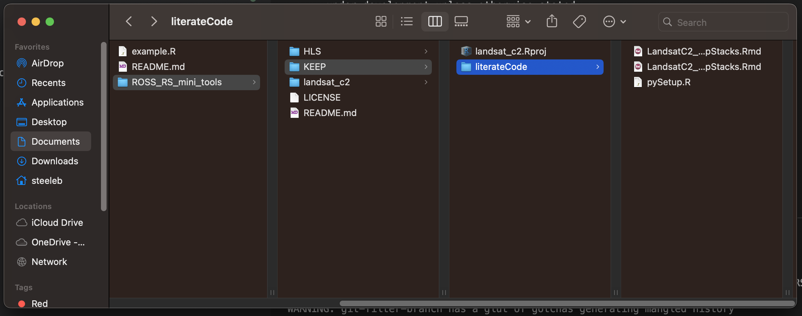

# Purpose

The easiest way to use the workflows in this repository is to fork the
[ROSSyndicate ROSS_RS_MINI_TOOLS
repository](https://github.com/rossyndicate/ROSS_RS_mini_tools), clone
to your local computer, then use the workflow subdirectories from this
clone. The purpose of this script is to describe how to clone singular
workflows from this repository into an existing repository, including
only the most recent updates to the repository and maintining code
attributions. Note, if future updates are made to the ROSS_RS_MINI_TOOLS
repository, you will not be able to easily update your local files.

# Requirements

You will need to have a working knowledge of the git functions at the
command line. To learn more about GitHub workflows at the command line,
see the [Git Cheat Sheet from GitHub](https://training.github.com/).
This guide also assumes you're using SSH authentication. (Follow these
directions)\[https://docs.github.com/en/authentication/connecting-to-github-with-ssh\]
for help with setting up SSH authentication.

------------------------------------------------------------------------

# The Process

## Step 1: Fork the Repository

At the [ROSSyndicate ROSS_RS_MINI_TOOLS
repository](https://github.com/rossyndicate/ROSS_RS_mini_tools), fork
the repositiory to your own account.

## Step 2: Navigate to the repository you want to add the Remote Sensing workflow to and prepare your repo

In your terminal, navigate to the clonded GH repositiory on your
computer. Here, our repo is called 'testing'.

a)  commit all changes and push them to origin.

In the terminal:

`git add .`

`git commit -m 'preparing to branch'`

`git push origin main'`

b)  create a new branch and switch to it. We'll call this branch
    'rs_clone'.

In the terminal:

`git checkout -b rs_clone`

## Step 3: Clone the repo and prune the files

a)  clone only the most recent commits (or the top layer) of your forked
    RS workflow repository to your subdirectory

In the terminal:

`git clone --depth 1 git@github.com:steeleb/ROSS_RS_mini_tools.git`

b)  now delete the remote for the ROSS_RS_MINI_TOOLS fork

In the terminal:

`cd ROSS_RS_mini_tools`

`git remote rm origin`

`cd ..`

c)  Delete unwanted files and directories. For this case, we only want
    to keep the landsat_c2.Rproj and the 'literateCode' folder. In your
    Windows Explorer or Mac Finder, navigate to the ROSS_RS_mini_tools
    subdirectory and move all desired files into a new folder, in this
    case we'll call it 'KEEP':

    All workflows are meant to be run with the associated RProj file, so be sure to copy that over to the keep folder as well.

d)  git filter to just the desired folder path

In the terminal:

`git filter-branch --subdirectory-filter ROSS_RS_MINI_TOOLS/KEEP -- --all`

This command will warn you that you're walking in 'gotcha' territory.
That's okay, just wait for it to time out.

d)  clean up your files to make git cooperate:

In the terminal:

`git reset --hard`

`git gc --aggressive`

`git prune`

`git clean -fd`

e)  move your KEEP folder into your desired subdirectory, here we call
    it 'landsat_c2'.

In the terminal:

`mkdir landsat_c2`

`mv ROSS_RS_mini_tools/KEEP/* landsat_c2/`

f)  delete the ROSS_RS_mini_tools directory

In the terminal:

`rm -r ROSS_RS_mini_tools`

If you recieve any 'override' statements, type 'y' and press enter for
each of them.

g)  commit your changes

In the terminal:

`git add .`

`git commit -m 'add Landsat C2 workflow from ROSSyndicate'`

## Step 4: Merge into main branch and commit

a)  go back to the main branch

In the terminal:

`git checkout main`

b)  merge the rs_clone branch

`git merge rs_clone`

c)  push your changes to origin

`git push origin main`
