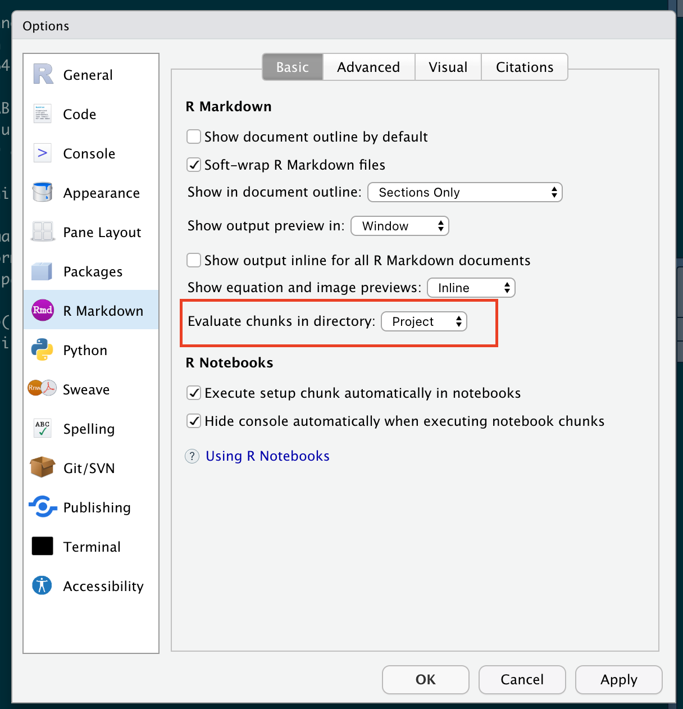

# Common Issues

Two script integrations that we commonly use in the workflows in this repository can be tricky to configure: gcloud and the Python ee module. This document outlines some common errors and how to fix them.

## gcloud

`gcloud` is Google's terminal authenticator for all of it's cloud applications, including Earth Engine and Google Cloud (Google's cloud storage system). [Installation and intialization of gcloud](https://cloud.google.com/sdk/docs/install-sdk) is sometimes incredibly on some devices, on others you may need to do quite a bit of trouble shooting. The most common error that is fixed by the below solutions is `glcoud command not found`. This means that `gcloud` is not properly installed or configured.

### __Suggestion #1:__ *Follow the directions precisely*

Follow the directions PRECISELY, ESPECIALLY the 'open a new terminal for your changes to take effect'. It's easy to get lost in the commands that are optional when they all look the same, but I can't tell you how many times I skipped a very simple step that was causing my gcloud initialization to fail.

### __Suggestion #2:__ *Re-initialize*

Close whatever terminal you're working in, re-open, and try to [re-initialize gcloud](https://cloud.google.com/sdk/docs/install-sdk#initializing_the).

### __Suggestion #3:__ *Mac Users, source the `path.zsh.inc` file*

For some reason, on some Mac computers, you have to point to this path.zsh.inc file. Try typing the following in your terminal, then try go back to Suggestion #2.

source './google-cloud-sdk/path.zsh.inc'

### __Suggestion #4:__ *Nuke it*

If in doubt, delete the 'google-cloud-sdk' folder and start from the beginning of the process.

## Python Earth Engine Module

Most of the time, the reason the module won't load is because your virtual environment isn't being detected. The most common error message is 'ModuleNotFoundError: No module named `ee`'. Here are some common fixes.

### __Suggestion #1:__ *make sure you're using the RProj file and processing code chunks relative to the RProj file*

All of the workflows are meant to be run in the associated RProj file. You should also confirm that your RMarkdown chunk evaluation in RStudio is running relative to the 'Project' file. To confirm this, go to 'Tools', then to 'Global Options'. In this pane, select 'R Markdown' and check the following setting:
 

If this was not set correctly before, your script may be looking in the 'wrong place' for python or the ee module. If you had to change this setting, delete the 'env' folder and re-run `pySource.R`.

### __Suggestion #2:__ *Delete the existing 'env' folder and rebuild the virtual environment*

In RStudio, virtual environments seem especially touchy, so it's suggested that you re-build the `reticulate` virtual environment in the pySource.R file everytime you run the code. In all workflows, this will be sourced towards the top of the Rmd file.

### __Suggestion #3:__ *Do not try to set up a virtual environment in Dropbox or OneDrive*

For whatever reason, `reticulate` environments do not play nicely in either Dropbox or OneDrive folders. We suggest cloning workflows to a file path on your computer, and not in the cloud on your computer.

